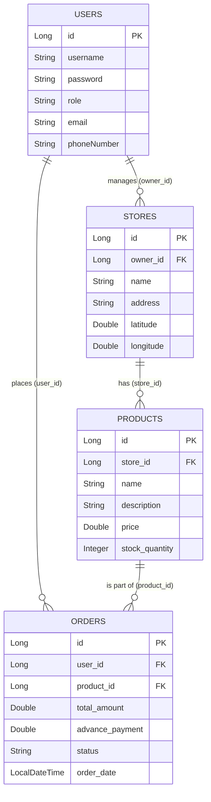

# O2O Clothing Store Platform Technical Document

## 1. Complete Spring Boot Project Folder Structure

```text
o2o-clothing-platform/
├── src/
│   ├── main/
│   │   ├── java/
│   │   │   └── com/
│   │   │       └── o2o/
│   │   │           └── clothing/
│   │   │               ├── config/
│   │   │               ├── controller/
│   │   │               │   ├── AdminController.java
│   │   │               │   ├── AuthController.java
│   │   │               │   ├── OrderController.java
│   │   │               │   ├── ProductController.java
│   │   │               │   ├── SearchController.java
│   │   │               │   └── StoreController.java
│   │   │               ├── entity/
│   │   │               │   ├── Order.java
│   │   │               │   ├── Product.java
│   │   │               │   ├── Store.java
│   │   │               │   └── User.java
│   │   │               ├── repository/
│   │   │               │   ├── OrderRepository.java
│   │   │               │   ├── ProductRepository.java
│   │   │               │   ├── StoreRepository.java
│   │   │               │   └── UserRepository.java
│   │   │               ├── service/
│   │   │               │   ├── AuthService.java
│   │   │               │   ├── OrderService.java
│   │   │               │   ├── ProductService.java
│   │   │               │   ├── SearchService.java
│   │   │               │   └── StoreService.java
│   │   │               ├── util/
│   │   │               │   └── HaversineUtil.java
│   │   │               └── O2oClothingApplication.java
│   │   ├── resources/
│   │   │   ├── static/
│   │   │   │   ├── css/
│   │   │   │   ├── js/
│   │   │   │   └── images/
│   │   │   ├── templates/
│   │   │   │   ├── add-product.html
│   │   │   │   ├── admin-dashboard.html
│   │   │   │   ├── login.html
│   │   │   │   ├── nearby-stores.html
│   │   │   │   ├── orders.html
│   │   │   │   ├── preorder.html
│   │   │   │   ├── products.html
│   │   │   │   ├── register.html
│   │   │   │   ├── store-dashboard.html
│   │   │   │   └── store-register.html
│   │   │   └── application.properties
│   └── test/
│       └── java/
│           └── com/
│               └── o2o/
│                   └── clothing/
└── pom.xml
```

---

## 2. Database ER Diagram



---

## 3. Database Tables

### `users` Table
| Column Name | Data Type | Constraints | Description |
|---|---|---|---|
| `id` | BIGINT | PRIMARY KEY, AUTO_INCREMENT | Unique identifier for a user |
| `username` | VARCHAR(50) | NOT NULL, UNIQUE | User's handle / login |
| `password` | VARCHAR(255) | NOT NULL | Encrypted password |
| `role` | VARCHAR(20) | NOT NULL | `CUSTOMER`, `STORE_OWNER`, or `ADMIN` |
| `email` | VARCHAR(100) | NOT NULL, UNIQUE | User contact email |
| `phone_number` | VARCHAR(20) | | User contact number |

### `stores` Table
| Column Name | Data Type | Constraints | Description |
|---|---|---|---|
| `id` | BIGINT | PRIMARY KEY, AUTO_INCREMENT | Unique store identifier |
| `owner_id` | BIGINT | FOREIGN KEY (`users.id`) | Store owner reference |
| `name` | VARCHAR(100) | NOT NULL | Store business name |
| `address` | VARCHAR(255) | NOT NULL | Physical address |
| `latitude` | DOUBLE | NOT NULL | GPS Latitude |
| `longitude` | DOUBLE | NOT NULL | GPS Longitude |

### `products` Table
| Column Name | Data Type | Constraints | Description |
|---|---|---|---|
| `id` | BIGINT | PRIMARY KEY, AUTO_INCREMENT | Unique product identifier |
| `store_id` | BIGINT | FOREIGN KEY (`stores.id`) | Reference to store |
| `name` | VARCHAR(100) | NOT NULL | Clothing item name |
| `description` | TEXT | | Product description |
| `price` | DOUBLE | NOT NULL | Full product price |
| `stock_quantity` | INT | NOT NULL, DEFAULT 0 | Remaining stock count |

### `orders` Table
| Column Name | Data Type | Constraints | Description |
|---|---|---|---|
| `id` | BIGINT | PRIMARY KEY, AUTO_INCREMENT | Unique order identifier |
| `user_id` | BIGINT | FOREIGN KEY (`users.id`) | Customer reference |
| `product_id` | BIGINT | FOREIGN KEY (`products.id`) | Preordered product reference |
| `total_amount` | DOUBLE | NOT NULL | Total cost of clothing item |
| `advance_payment` | DOUBLE | NOT NULL | 20% advance payment amount |
| `status` | VARCHAR(50) | NOT NULL | `RESERVED`, `COMPLETED`, `CANCELLED` |
| `order_date` | DATETIME | NOT NULL | Timestamp of preorder |

---

## 4. REST API Endpoints Documentation

| Module | HTTP Method | Endpoint | Description | Payloads / Parameters |
|---|---|---|---|---|
| **Auth** | `POST` | `/api/auth/register` | Register new user | JSON: `{username, password, role, ...}` |
| **Auth** | `POST` | `/api/auth/login` | Login and establish session | JSON: `{username, password}` |
| **Store** | `POST` | `/api/stores` | Register a new store | JSON: `{name, address, latitude, longitude}` |
| **Store** | `PUT` | `/api/stores/{id}` | Update store details | JSON: `{name, address}` |
| **Store** | `GET` | `/api/stores/{id}` | Get specific store profile | `id` (path var) |
| **Product**| `POST` | `/api/products` | Add a new clothing item | JSON: `{name, price, stock, storeId}` |
| **Product**| `PUT` | `/api/products/{id}` | Update clothing item | JSON: `{price, stock}` |
| **Product**| `DELETE` | `/api/products/{id}` | Delete clothing item | `id` (path var) |
| **Product**| `GET` | `/api/products/store/{id}`| List inventory of a store | `storeId` (path var) |
| **Search** | `GET` | `/api/search/nearby` | Discover stores in 5km | Params: `lat`, `lng` |
| **Order** | `POST` | `/api/orders/preorder` | Create preorder (20% advance)| JSON: `{userId, productId}` |
| **Order** | `GET` | `/api/orders/user/{id}` | Get customer order history| `userId` (path var) |
| **Order** | `GET` | `/api/orders/store/{id}`| Get store's preorders | `storeId` (path var) |
| **Admin** | `GET` | `/api/admin/users` | List all registered users | - |
| **Admin** | `GET` | `/api/admin/stores` | List all stores | - |

---

## 5. Entity Classes with JPA Annotations

```java
// User.java
@Entity
@Table(name = "users")
public class User {
    @Id
    @GeneratedValue(strategy = GenerationType.IDENTITY)
    private Long id;
    
    @Column(unique = true, nullable = false)
    private String username;
    
    @Column(nullable = false)
    private String password;
    
    @Column(nullable = false)
    private String role; // CUSTOMER, STORE_OWNER, ADMIN
    
    @Column(unique = true, nullable = false)
    private String email;
    
    private String phoneNumber;
    
    // Getters and Setters ...
}

// Store.java
@Entity
@Table(name = "stores")
public class Store {
    @Id
    @GeneratedValue(strategy = GenerationType.IDENTITY)
    private Long id;

    @ManyToOne(fetch = FetchType.LAZY)
    @JoinColumn(name = "owner_id", nullable = false)
    private User owner;

    @Column(nullable = false)
    private String name;
    
    @Column(nullable = false)
    private String address;
    
    @Column(nullable = false)
    private Double latitude;
    
    @Column(nullable = false)
    private Double longitude;

    // Getters and Setters ...
}

// Product.java
@Entity
@Table(name = "products")
public class Product {
    @Id
    @GeneratedValue(strategy = GenerationType.IDENTITY)
    private Long id;

    @ManyToOne(fetch = FetchType.LAZY)
    @JoinColumn(name = "store_id", nullable = false)
    private Store store;

    @Column(nullable = false)
    private String name;
    
    private String description;
    
    @Column(nullable = false)
    private Double price;
    
    @Column(nullable = false)
    private Integer stockQuantity;

    // Getters and Setters ...
}

// Order.java
@Entity
@Table(name = "orders")
public class Order {
    @Id
    @GeneratedValue(strategy = GenerationType.IDENTITY)
    private Long id;

    @ManyToOne(fetch = FetchType.LAZY)
    @JoinColumn(name = "user_id", nullable = false)
    private User user;

    @ManyToOne(fetch = FetchType.LAZY)
    @JoinColumn(name = "product_id", nullable = false)
    private Product product;

    @Column(nullable = false)
    private Double totalAmount;
    
    @Column(nullable = false)
    private Double advancePayment; // 20% of total
    
    @Column(nullable = false)
    private String status; // RESERVED, COMPLETED, CANCELLED
    
    @Column(nullable = false)
    private LocalDateTime orderDate;

    // Getters and Setters ...
}
```

---

## 6. Repository Interfaces using Spring Data JPA

```java
@Repository
public interface UserRepository extends JpaRepository<User, Long> {
    Optional<User> findByUsername(String username);
}

@Repository
public interface StoreRepository extends JpaRepository<Store, Long> {
    List<Store> findByOwnerId(Long ownerId);
    @Query("SELECT s FROM Store s") // Basic fetch; real location filtering can be handled in-memory using Haversine or via native SQL math query.
    List<Store> findAllStores();
}

@Repository
public interface ProductRepository extends JpaRepository<Product, Long> {
    List<Product> findByStoreId(Long storeId);
}

@Repository
public interface OrderRepository extends JpaRepository<Order, Long> {
    List<Order> findByUserId(Long userId);
    List<Order> findByProductStoreId(Long storeId);
}
```

---

## 7. Service Layer Structure

```java
@Service
public class AuthService {
    // Methods: registerUser(), authenticateUser(), hashPassword()
}

@Service
public class StoreService {
    // Methods: registerStore(), updateStore(), getStoreById(), getStoresByOwner()
}

@Service
public class ProductService {
    // Methods: addProduct(), updateProduct(), deleteProduct(), getInventoryByStore()
}

@Service
public class SearchService {
    // Uses HaversineUtil
    // Methods: findNearbyStores(double userLat, double userLon, double radiusKm)
}

@Service
public class OrderService {
    // Methods: createPreorder(Long userId, Long productId), calculateAdvance(Double price), getUserOrders()
}
```

---

## 8. Controller Layer with REST Endpoints

```java
@RestController
@RequestMapping("/api/auth")
public class AuthController {
    // @PostMapping("/register") -> authService.registerUser(...)
    // @PostMapping("/login") -> authService.authenticateUser(...)
}

@RestController
@RequestMapping("/api/stores")
public class StoreController {
    // Handle store CRUD mapping requests logic via storeService.
}

@RestController
@RequestMapping("/api/products")
public class ProductController {
    // Handle product management requests via productService.
}

@RestController
@RequestMapping("/api/search")
public class SearchController {
    // @GetMapping("/nearby") -> searchService.findNearbyStores(lat, lng, 5.0)
}

@RestController
@RequestMapping("/api/orders")
public class OrderController {
    // @PostMapping("/preorder") -> calls orderService.createPreorder(...)
}

@RestController
@RequestMapping("/api/admin")
public class AdminController {
    // Handle general read routes across repositories for total views.
}
```
*(Note: These are REST counterparts to the Application UI controllers which return Thymeleaf views.)*

---

## 9. Thymeleaf UI Page Descriptions

| Template File | Module | Description |
|---|---|---|
| `login.html` | Auth | Form for `username` and `password`. Handles session creation. |
| `register.html` | Auth | Form for new users to enter details and select role (`CUSTOMER`/`STORE_OWNER`). |
| `store-register.html` | Store | Form for store owners to register their store's name, address, and GPS coordinates. |
| `store-dashboard.html` | Store | Interface for store owners to see their registered stores and quick stats. |
| `add-product.html` | Product | Form to define a clothing piece (name, price, stock) and link it to a store. |
| `products.html` | Product | The store's inventory list showing current stock and a button to delete/update. |
| `nearby-stores.html` | Search | Customer page. Uses HTML5 Geolocation to grab lat/lng, hits search API, displays a list of stores within 5KM. |
| `preorder.html` | Order | Customer checkout page showing product details, full price, and calculating the exact 20% advance fee to reserve. |
| `orders.html` | Order | View history of `RESERVED` items for a customer, or a queue of pickups waiting for the store owner. |
| `admin-dashboard.html` | Admin | High-level data tables listing all users, all stores, and system-wide products for administrative oversight. |

---

## 10. System Workflow Explanation

1. **User Registration & Flow:** 
   - A user visits the platform and registers as either a `CUSTOMER` or a `STORE_OWNER`.
   - Upon logging in, sessions redirect users based on their roles.
2. **Store Setup (Owner Flow):**
   - A `STORE_OWNER` navigates to the store registration page, inputs store details, and saves geographical coordinates (latitude/longitude).
   - Once a store is active, the owner adds clothing items (Price, Name, Stock) via the Inventory UI.
3. **Discovery (Customer Flow):**
   - A `CUSTOMER` provides their location on the `nearby-stores.html` page. 
   - The platform uses `SearchService` & `HaversineUtil` to filter stores from the DB, returning only those under a **5 km radius**.
4. **Preordering & Reserve:**
   - The customer browses the nearby store’s catalog and selects a product.
   - At checkout (`preorder.html`), the system extracts the item’s price and calculates a **20% advance payment**.
   - Upon simulated payment success, an `Order` is generated with a `RESERVED` status, and the product's `stockQuantity` drops by 1.
5. **Fulfillment:**
   - The customer visits the physical store, tries the clothing on, pays the remaining 80%, and the store owner updates the order status to `COMPLETED`.

---

## 11. 2-Day Development Plan for a Team Project

### Team Size: 5 Members

**Goal Structure:** Parallel development by dividing the monolithic structure into its 5 distinct functional modules.

### Day 1: Architecture & Backend Foundation

| Time | Team Member | Task Description | Dependencies / Notes |
|---|---|---|---|
| **Morning (Hours 1-4)** | **All Members** | Database generation, configure `application.properties`, setup Git wrapper, basic layout. | Unified starting point. |
| | Member 1 (Auth) | Setup `User` Entity, Repo, `login`/`register` Thymeleaf templates & Spring Security/Session structure. | None. |
| | Member 2 (Store) | Setup `Store` Entity, Repo, `StoreController` REST APIs, test with Postman. | Relies on Auth (User ID). |
| | Member 3 (Product)| Setup `Product` Entity, Repo, `ProductController` CRUD ops. | Relies on Store (Store ID).|
| | Member 4 (Search) | Build `HaversineUtil.java`, mockup coordinates in test files. | None. |
| | Member 5 (Order) | Setup `Order` Entity, Repo. Define the 20% calculation logic. | Relies on User & Product.|
| **Afternoon (Hours 5-8)**| **All Members** | **Integration Point 1**. Merge entities and ensure DB schemas build correctly using `spring.jpa.hibernate.ddl-auto=update`. | Resolve any FK issues. |
| | Member 1 | Begin hooking up backend Auth to frontend templates. | |
| | Member 2 | Build `store-dashboard.html` & `store-register.html`. | |
| | Member 3 | Build `add-product.html` & `products.html`. | |
| | Member 4 | Connect Haversine logic to `SearchController` and `StoreRepository`. | |
| | Member 5 | Create basic `admin-dashboard.html` views and `orders.html` data layout. | |

### Day 2: Frontend Connections & Testing

| Time | Team Member | Task Description | Dependencies / Notes |
|---|---|---|---|
| **Morning (Hours 1-4)** | Member 1 (Auth) | Finalize role-based redirects. Manage session persistence. | |
| | Member 2 (Store) | Ensure UI properly submits to backend and handles mapping. | |
| | Member 3 (Product)| Connect Product creation UI to store instances. | |
| | Member 4 (Search) | Build `nearby-stores.html`; connect HTML5 Geolocation to backend Search API. | Relies on Store existing in DB. |
| | Member 5 (Order) | Build `preorder.html`; finalize the checkout endpoint reserving stock. | |
| **Afternoon (Hours 5-8)**| **All Members** | **Bug Bash & End-to-End Walkthrough.** | |
| | Member 1 (Auth) | Verify users can't breach unauthorized paths. | |
| | Member 2 (Store) | Fix data validation issues in Store dashboards. | |
| | Member 3 (Product)| Fix inventory stock subtraction edge cases. | |
| | Member 4 (Search) | Guarantee Haversine mathematical limits actually block >5KM stores on UI. | |
| | Member 5 (Order) | Ensure orders cascade properly to admin and store owner screens. | |
| **EOD End of Day** | **All Members** | Final Git Merge -> Main. Deliverable presentation. | Documentation is reviewed. |
